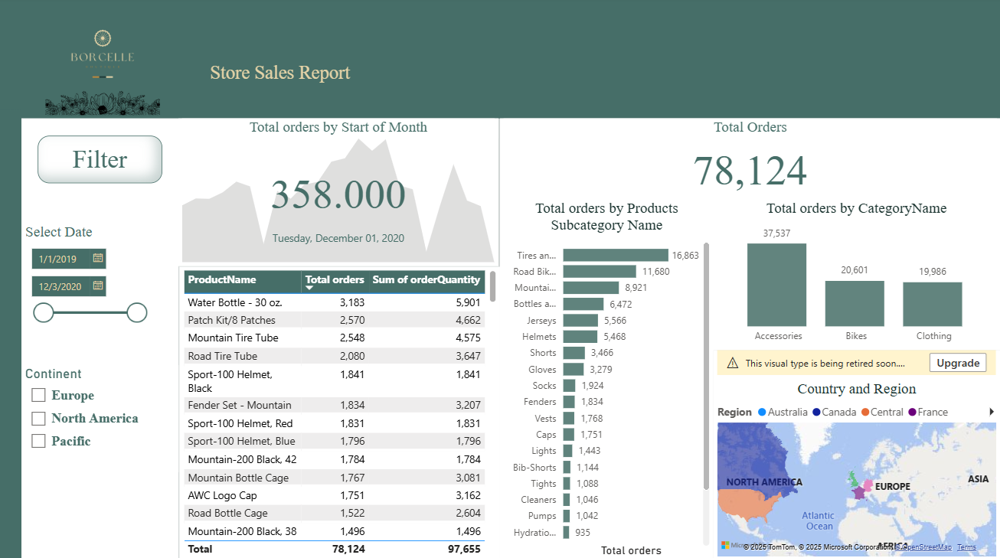
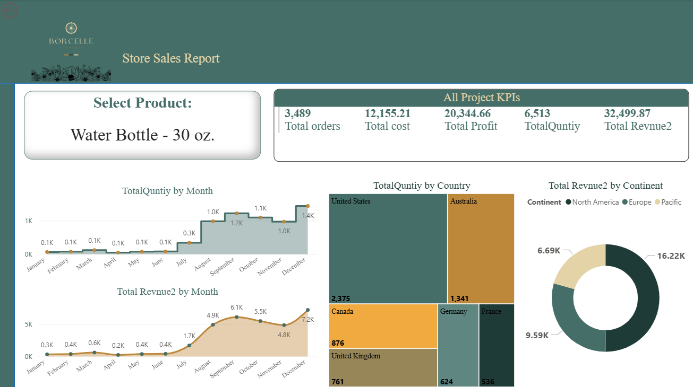

# 📊 Store Sales Report - Power BI

This project is an **interactive Power BI dashboard** that analyzes store sales performance across products, categories, and regions.

---

## 🚀 Features
- Total sales and orders overview  
- Breakdown by **Product Category** and **Subcategory**  
- Regional performance with interactive **map visualization**  
- Date and Continent filters for dynamic insights  

---

## 🛠 Tools & Technologies
- **Power BI Desktop**  
- **Data Modeling** (relationships between Sales, Products, Customers, Calendar tables)  
- **DAX** for calculated measures  

---

## 📷 Dashboard Preview

### Main Page  
  

### Product Details Page  
  

---

## 📁 Files in this Repo
- `Store_Sales_Report.pbix` → Full Power BI project file  
- `screenshots/main_page.png` → Main dashboard screenshot  
- `screenshots/product_details.png` → Product details page screenshot  
- `README.md` → Project documentation  

---

## 🎯 Objective
This project demonstrates my skills in:  
- **Data Modeling & Visualization**  
- **Business Intelligence with Power BI**  
- **Building interactive dashboards for decision-making**  

---

## 👩‍💻 Author
**Shahad Alharbi**  
📌 Computer Science Graduate | Passionate about Data & Analytics  
 
